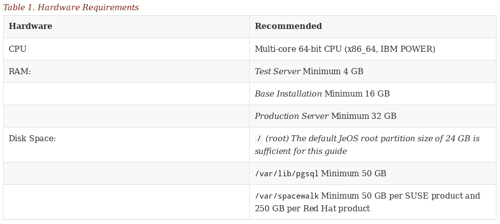

:customcss: style.css
:revealjs_theme: suse
:revealjs_progress: true
:revealjs_slideNumber: true
:icons: font
:ppc: POWER

[background-color="white"]
= Modernizing the SUMA Doc Process

[greetings.introduction]
== Greetings and Introduction

SUSE Manager Doc Process +
Joseph Cayouette +
jcayouette@suse.de +
19.06.2018 +

[NOTE.speaker]
--
* Hello, I think most of you already know who I am.
* However if you do not, My name is Joseph Cayouette and I represent the lead technical writer for SUSE Manager.
* I would like to give a big thanks to Karl for his efforts from the SUSE Doc team office and provide a warm welcome to our new colleague Lana Brindley representing our Australian branch.
--

[modernization.goals]
== Goals

[%step]
* Enable simple contribution (New format Asciidoc)
* Treat AsciiDoc like code
 (branch, fix, pull request, review, merge)
* Automation (Review, Merge, build, and publish via travisci)
* Building a community around SUSE Manager and Uyuni

[NOTE.speaker]
--
* So Ill get right into it as I have a fair amount of content to cover.
I think most of us would agree that XML is machine friendly, and ultimately as a source it is quite unfriendly for us to digest or work with as humans.
Asciidoc fulfills the requirement as a human friendly source and provides output to machine friendly XML.
* Documentation should be written as code along with the feature development of a product.
Docs are doomed to be behind release if they are not written along side the development of new features.
* Developers should write explanatory documentation at stable intervals while coding to prepare a foundation for technical writers.
* One contributions(PRs) are reviewed, travisci picks up the latest repo changes and updates online documentation in near realtime.
* It is my hope that the simplified workflow gained by migrating to asciidoc, working with docs as code, and automating the publishing of documentation will aid us in establishing a community around SUSE Manager and uyuni.
--

[xml.vs.asciidoc.part.one]
== XML vs. Asciidoc Part I

----
Example: Docbook/XML (fraction)
<table xml:id="tab.wbem.setting.daemon.1" frame="topbot" rowsep="0">
 <title>Commands for Managing sfcbd</title>
 <tgroup cols="2">
 <colspec colnum="1" colname="1"/>
 <colspec colnum="2" colname="2"/>
 <thead>
 <row rowsep="1">
 <entry colname="1">
 <para>
 Task
 </para>
 </entry>
 <entry colname="2">
 <para>
 Linux Command
 </para>
 </entry>
 </row>
 </thead>
 ...
----

[NOTE.speaker]
--

* The following example clearly demonstrates why xml should not be used for contribution.
* The amount of boilerplate is ridiculous for casual contribution and requires complex tooling to be setup before work can even begin.
* For example OxygenXML, vi and emacs all require highly specific configurations via DTDs, and xml catalogs.

--

[xml.vs.asciidoc.part.two]
== XML vs. Asciidoc Part II

Example: AsciiDoc (complete)
----
[cols="1,1", options="header"]
.Hardware Requirements
|===
| Hardware     | Recommended
| CPU:         | Multi-core 64-bit CPU (x86_64, IBM POWER)
| RAM:         | Test Server Minimum 4 GB
|              | Base Installation Minimum 16 GB
|              | Production Server Minimum 32 GB
| Disk Space:  | [path]``/`` (root) 24 GB
|              | [path]``/var/lib/pgsql`` Minimum 50 GB
|              | [path]``/var/spacewalk`` Minimum 50 GB per SUSE product and 250 GB per Red Hat product
|===
----

[NOTE.speaker]
--
The simplicity of Asciidoc table markup.
Its just text!
--

[xml.vs.asciidoc.part.three]
== XML vs. Asciidoc Part III

[NOTE.speaker]
--
A rendered Asciidoc table.
--

[build.process.part.one]
== Build Process Part I

[%step]
* Content submitted by community in Asciidoc format
* The Asciidoctor Ruby gem provides the conversion to Docbook 5 XML
* The SUSE Docbook Authoring and Publishing Suite(DAPS) enables export of various formats (PDF, EPUB, HTML Single and chunked)

[NOTE.speaker]
--
Everyone can now contribute.
--

[build.process.part.two]
== Build Process Part II

* We use a Makefile to bind these tools together and produce our output formats

image::rube-goldberg-machine.jpg[400, 600]

[documentation.repo.links]
== Documentation Resources

[%step]
* https://github.com/SUSE/doc-susemanager[github.com/SUSE/doc-susemanager]
* https://github.com/SUSE/doc-susemanager/blob/develop/adoc/MAIN-manager.adoc[doc-susemanager/adoc/MAIN-manager.adoc]
* https://github.com/SUSE/doc-susemanager/wiki[doc-susemanager/wiki]
* https://github.com/SUSE/doc-susemanager/wiki/Asciidoc-getting-started[Getting Started with Asciidoc]

[NOTE.speaker]
--

* The current location of our SUSE Manager documentation repository is on github under the SUSE organization.
* If you wish to view the sources on github browse to the following url. As you see, github renders adoc sources similar to markdown.
* I have also have created a wiki covering our documentation process.
* The goal of this wiki is to provide resources for contributing to suse manager/uyuni with asciidoc, and to help define a few simple styling rules.

--

[automation.research]
== CI and documentation

[%step]
* https://jcayouette.github.io/suse-publisher/index.html
* https://travis-ci.org/jcayouette/suse-publisher/builds

[NOTE.speaker]
--
* During the last hackweek I invested time in learning how to apply continuous integration to documentation.
* Here is a basic example page.
* You notice we have an edit me button which leads to the source page on github.
* Lets make a change, save the file and have a look at travisci as it picks up the changes.
* For now Ill move on, we can revisit suse-publisher in a few minutes.
--

[asciidoctor.browser.plugin]
== The Asciidoc Browser Plugin

[%step]
* https://github.com/SUSE/doc-susemanager/wiki/Asciidoc-getting-started#asciidoctorjs-browser-extension[Asciidoctorjs Browser Extension (Chrome, Firefox, Opera)]
* https://github.com/SUSE/doc-susemanager/blob/develop/adoc/quickstart3_chap_install_overview.adoc#gs-overview[Example Document]

[NOTE.speaker]
--
* I need to mention there is a superb browser extension for rendering and updating your adoc sources in realtime.
* To use the plugin and see rendered html, open any adoc file you are editing in the browser.
* Once you save your file, the plugin will pick up the changes on the local file system and update.
--

== What's Next Part I

[%step]
* Completion of our CI platform for up-to-date Devel docs
* Integration of Algolia or Lucene for proper indexing and realtime search
* Begin planning the Uyuni and SUSE Manager documentation relationship

[NOTE.speaker]
--
We can build documentation currently using entities for product names, however we still need to establish a workflow for managing upstream and downstream commits, and refine a process for cherry picking commits from Uyuni to SUSE Manager repositories.
--

== What's Next Part II

A Proposed name change for two of our books.

[%step]
* AT -> Deployment and Installation (covering proxy, server, IBM POWER, System z, virtualization etc...)
* BP -> Administration (Covering backup, updates, service pack migration, adding custom channels, troubleshooting etc....)
* The Reference and Getting Started Books will remain the same

[NOTE.speaker]
--
I suggest for the next major release we rename our documents to help make search more intuitive. I propose the above names as they provide a clean foundation for topics vs. the more abstract and frustrating titles advanced topics and best practices.
--

== Revisiting SUSE Publisher

* https://jcayouette.github.io/suse-publisher/manager-index.html[Build Passing]

"I hope"

[NOTE.speaker]
--
Alright so I believe enough time has passed for travis to do its magic. Lets go ahead and check in with our doc building progress.
--

== Question and Answer

Are there any questions regarding the new process?
If you have any suggestions or smart remarks please contact me:

jcayouette@suse.de

== Final Words

Thank you for your time!

